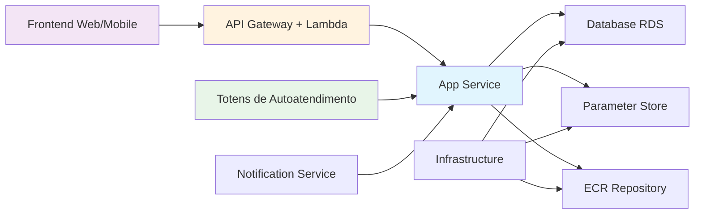
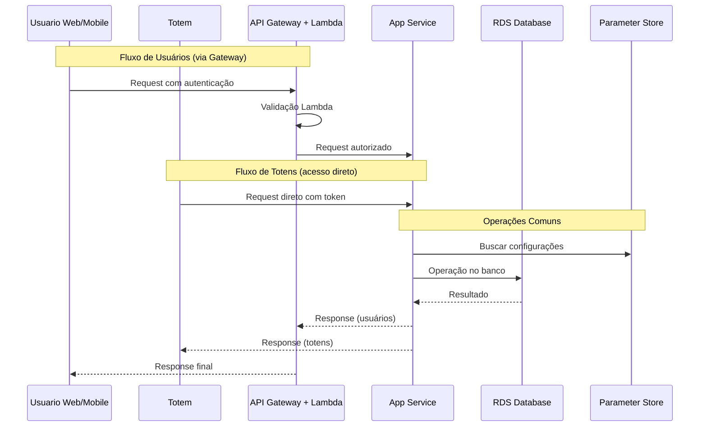
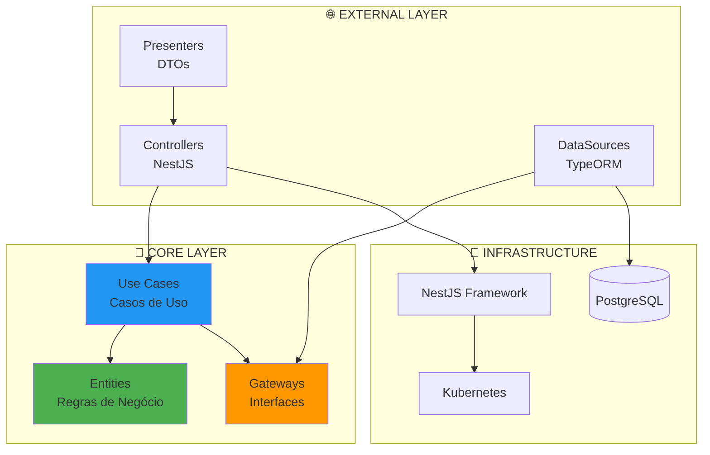
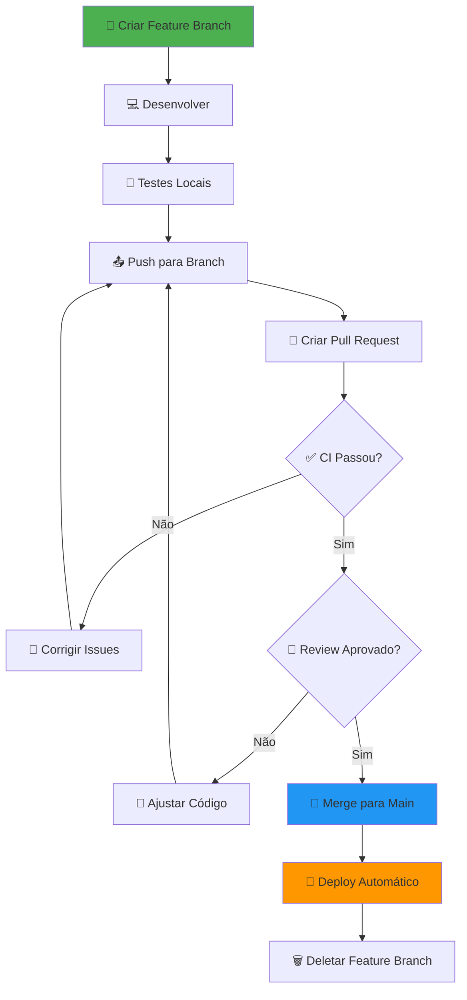
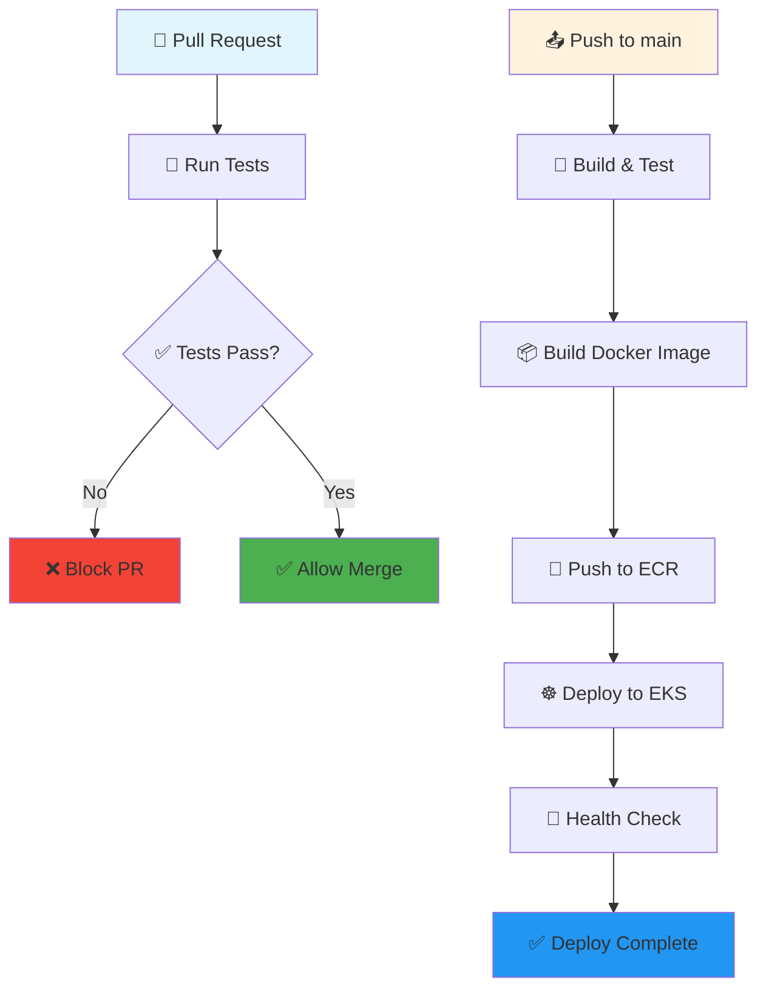
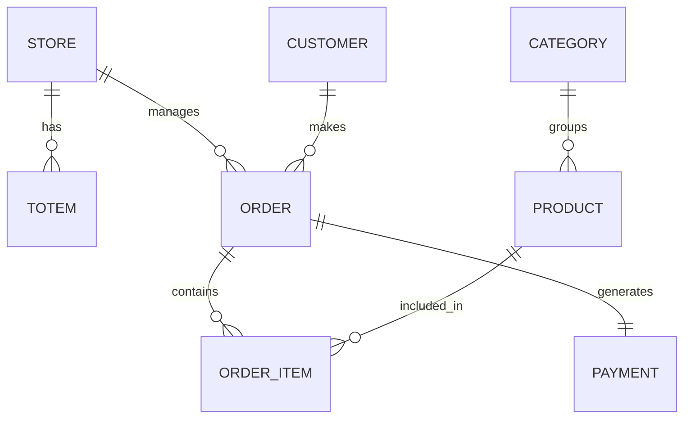

# 🍔 App Service - API de Autoatendimento  

[](https://github.com/FIAP-Tech-Challange/app-service/actions/workflows/ci.yml)

## � DESCRIÇÃO DO REPOSITÓRIO

### Sobre o Serviço

O **App Service** é a API principal do sistema de autoatendimento para lanchonetes, desenvolvida com **NestJS** e **Clean Architecture**. Este serviço recebe tráfego de duas fontes:

- **🚪 API Gateway + Lambda**: Para validação de usuários e autenticação
- **🖥️ Totens**: Acesso direto para operações de autoatendimento

> **⚠️ IMPORTANTE**: O Gateway é usado apenas para validação de usuários. Os totens acessam diretamente a API.

### Integração com Outros Repositórios

Este repositório faz parte de um ecossistema maior e possui as seguintes dependências:



**Repositórios Relacionados:**

- 🌐 **Frontend**: Interface web/mobile para usuários
- 🚪 **API Gateway + Lambda**: Validação de usuários apenas
- 🖥️ **Totens**: Interface de autoatendimento (acesso direto)
- 🏗️ **Infrastructure**: Terraform para provisionamento AWS
- 📧 **Notification Service**: Serviço de notificações
- 📊 **Monitoring**: Observabilidade e métricas

### Fluxo de Comunicação



## 🏗️ ARQUITETURA DETALHADA

### Stack Tecnológica Completa

#### Core Framework

- **🎯 NestJS**: Framework Node.js para APIs escaláveis
- **📘 TypeScript**: Tipagem estática e desenvolvimento robusto
- **🧪 Jest**: Framework de testes unitários e integração
- **📖 Swagger/OpenAPI**: Documentação automatizada da API

#### Persistência e Dados

- **� PostgreSQL**: Banco de dados relacional principal
- **📊 TypeORM**: ORM para TypeScript com migrations
- **💾 AWS RDS**: PostgreSQL gerenciado na AWS
- **� AWS Parameter Store**: Gerenciamento seguro de configurações

#### Infraestrutura e Deploy

- **� Docker**: Containerização da aplicação
- **☸️ Kubernetes (EKS)**: Orquestração e escalabilidade
- **📦 Amazon ECR**: Registry privado de imagens Docker
- **🔄 GitHub Actions**: CI/CD automatizado
- **🏗️ Terraform**: Infrastructure as Code

### Padrões Arquiteturais

#### Clean Architecture Implementation

A aplicação segue rigorosamente os princípios da **Clean Architecture**, garantindo:

- **🔄 Inversão de Dependência**: Core não depende de detalhes externos
- **🧪 Testabilidade**: Regras de negócio isoladas e testáveis
- **🔌 Independência de Framework**: Lógica desacoplada do NestJS
- **📱 Independência de UI**: API agnóstica à interface
- **🗄️ Independência de Banco**: Abstrações para persistência



### Estrutura de Pastas Detalhada

```
📁 app-service/
├── 📄 .github/workflows/           # 🔄 CI/CD Pipelines
│   └── ci.yml                     # Build, test e deploy automatizado
├── 📁 src/                        # 🎯 Código fonte principal
│   ├── 📄 CLEAN_ARCHITECTURE_GUIDE.md  # 📖 Guia da arquitetura
│   ├── 📁 common/                 # 🔗 Elementos compartilhados
│   │   ├── 📁 dataSource/         # 🔌 Interfaces de dados
│   │   ├── 📁 DTOs/               # 📦 Data Transfer Objects
│   │   └── 📁 exceptions/         # ⚠️ Exceções customizadas
│   ├── 📁 core/                   # 🎯 CAMADA DE NEGÓCIO
│   │   ├── 📁 common/             # 🛠️ Utilitários e Value Objects
│   │   │   ├── 📁 utils/          # 🔧 Helpers (UUID, encoder)
│   │   │   └── 📁 valueObjects/   # 💎 CPF, Email, CNPJ, Phone
│   │   └── 📁 modules/            # 📦 Módulos de domínio
│   │       ├── 📁 customer/       # 👥 Gestão de clientes
│   │       ├── 📁 order/          # 🛒 Gestão de pedidos
│   │       ├── 📁 payment/        # 💳 Processamento de pagamentos
│   │       ├── 📁 product/        # 📦 Catálogo de produtos
│   │       └── 📁 store/          # 🏪 Gestão de lojas
│   └── 📁 external/               # 🌐 CAMADA EXTERNA
│       ├── 📁 consumers/          # 🚪 Controllers NestJS
│       └── 📁 dataSources/        # 💾 Implementações TypeORM
├── 📁 terraform/                  # 🏗️ Infrastructure as Code
│   ├── 📄 main.tf                 # Configuração principal
│   ├── 📄 kubernetes.tf           # Recursos K8s
│   └── 📄 variables.tf            # Variáveis do Terraform
├── 📁 test/                       # 🧪 Testes automatizados
│   ├── 📄 jest.setup.ts           # Configuração Jest
│   └── 📁 core/                   # Testes unitários
└── 📄 docker-compose.yml          # 🐳 Ambiente de desenvolvimento
```

### Princípios Implementados

#### SOLID Principles

- **🔲 Single Responsibility**: Cada classe tem uma única responsabilidade
- **🔓 Open/Closed**: Extensível sem modificação
- **🔄 Liskov Substitution**: Substituibilidade de implementações
- **� Interface Segregation**: Interfaces específicas e coesas
- **⬇️ Dependency Inversion**: Dependa de abstrações, não implementações

#### Domain-Driven Design (DDD)

- **🏢 Bounded Contexts**: Módulos bem definidos (customer, order, payment)
- **📦 Entities**: Objetos com identidade única
- **💎 Value Objects**: Objetos imutáveis (CPF, Email)
- **🚪 Gateways**: Contratos para acesso externo
- **📋 Use Cases**: Regras de negócio encapsuladas

## � SEGURANÇA E PROTEÇÃO DA BRANCH

### Branch Protection Rules

Este repositório implementa **proteção rigorosa** na branch `main` para garantir qualidade e segurança:

> **⚠️ IMPORTANTE**: Pushes diretos para `main` são **BLOQUEADOS**. Apenas via Pull Request.

#### Regras Implementadas

- 🚫 **Direct Push Blocked**: Nenhum push direto permitido na `main`
- ✅ **PR Obrigatório**: Todas as mudanças via Pull Request
- 👥 **Code Review**: Mínimo de 1 aprovação obrigatória
- 🧪 **Status Checks**: CI deve passar antes do merge
- 🔄 **Update Branch**: Branch deve estar atualizada antes do merge
- 🗑️ **Delete Head**: Branch de feature é removida após merge

### Workflow de Contribuição



### Processo de Deploy Seguro

#### Step-by-Step Contributing

1. **🌱 Criação de Branch**

   ```bash
   git checkout main
   git pull origin main
   git checkout -b feat/sua-feature
   ```

2. **💻 Desenvolvimento Local**

   ```bash
   # Instalar dependências
   npm install

   # Ambiente de desenvolvimento
   cp env-example .env
   docker-compose up -d

   # Desenvolvimento com hot-reload
   npm run start:dev
   ```

3. **🧪 Validação Local**

   ```bash
   # Testes unitários
   npm test

   # Testes com coverage
   npm run test:cov

   # Lint e formatação
   npm run lint
   npm run format
   ```

4. **📤 Push e PR**

   ```bash
   git add .
   git commit -m "feat: sua nova feature"
   git push origin feat/sua-feature
   # Criar PR via GitHub UI
   ```

5. **✅ Aprovação e Merge**

   - CI automaticamente executado
   - Review obrigatório por 1+ pessoas
   - Merge apenas após todas as verificações

6. **🚀 Deploy Automático**
   - Merge em `main` triggera deploy
   - Build e push para ECR
   - Deploy automático no EKS
   - Testes de saúde pós-deploy

## �📚 Documentação da API

### 🔗 Swagger Documentation

A documentação completa da API está disponível através do Swagger:

**🌐 URL Local**: [http://localhost:3000/docs](http://localhost:3000/docs)

**📄 Collection JSON**: [swagger-docs.json](./swagger-docs.json)

### 🔑 Endpoints Principais

#### 🏪 **Autenticação e Lojas**

```http
POST /v1/auth/login           # Login da loja
POST /v1/stores               # Cadastro de nova loja
GET  /v1/stores               # Dados da loja autenticada
POST /v1/stores/totems        # Criar totem
DELETE /v1/stores/totems/{id} # Remover totem
```

#### 👥 **Clientes**

```http
POST /v1/customers            # Cadastrar cliente
GET  /v1/customers            # Listar clientes (paginado)
GET  /v1/customers/{id}       # Buscar por ID
GET  /v1/customers/cpf/{cpf}  # Buscar por CPF
```

#### 📦 **Produtos e Categorias**

```http
GET  /v1/categories           # Listar categorias
POST /v1/categories           # Criar categoria
POST /v1/categories/{id}/products    # Criar produto
DELETE /v1/categories/{catId}/products/{prodId} # Remover produto
```

#### 🛒 **Pedidos**

```http
POST /v1/order                # Criar pedido
GET  /v1/order/all            # Listar pedidos (paginado)
GET  /v1/order/sorted-list    # Lista ordenada por status
GET  /v1/order/{id}           # Buscar pedido
PATCH /v1/order/{id}/prepare  # Marcar como "Em Preparo"
PATCH /v1/order/{id}/ready    # Marcar como "Pronto"
PATCH /v1/order/{id}/finished # Marcar como "Finalizado"
```

#### 💳 **Pagamentos**

```http
POST /v1/payment              # Criar pagamento
GET  /v1/payment/{id}         # Consultar pagamento
PATCH /v1/payment/{id}/approve # Aprovar pagamento (webhook)
PATCH /v1/payment/{id}/cancel  # Cancelar pagamento (webhook)
```

### 🔐 Autenticação

A API utiliza múltiplos esquemas de autenticação:

- **`access-token`**: JWT Bearer para lojas autenticadas
- **`totem-token`**: Token específico para totems
- **`api-key`**: Chave de API para endpoints públicos
- **`external-payment-consumer-key`**: Chave para webhooks de pagamento

## 🚀 Guia Completo de Execução

### 📋 Pré-requisitos

- **Docker** (v20+) e **Docker Compose** (v2+)
- **Node.js** (v18+) para desenvolvimento local
- **Kubernetes** (MicroK8s/Kind/AKS/EKS/GKE) para deploy em produção

### 🐳 Execução Local com Docker

#### 1. **Configuração do Ambiente**

```bash
# Clone o repositório
git clone https://github.com/davidasteixeira/tech-challenge.git
cd tech-challenge

# Configure as variáveis de ambiente
cp env-example .env
# Ajuste as variáveis no arquivo .env conforme necessário
```

Ajuste as variáveis conforme necessário no arquivo `.env` criado.

#### 2. **Inicialização dos Serviços**

```bash
# Inicie todos os serviços
docker-compose up -d

# Verifique os logs
docker-compose logs -f

# Verifique o status dos containers
docker-compose ps
```

#### 3. **Acesso à Aplicação**

- **API**: [http://localhost:3000](http://localhost:3000)
- **Swagger**: [http://localhost:3000/docs](http://localhost:3000/docs)
- **Health Check**: [http://localhost:3000/health](http://localhost:3000/health)

### ☸️ Deploy Kubernetes com Terraform

Para deploy completo em Kubernetes usando Terraform, consulte a documentação específica:

**📖 [Documentação Terraform](./terraform/README.md)**

A solução Terraform inclui:

- **Infraestrutura como Código**: Versionamento e reprodutibilidade completa
- **Deploy Automatizado**: Pipeline CI/CD integrado com GitHub Actions
- **Recursos Kubernetes**: Namespace, ConfigMap, Secrets, Deployment, Services, HPA
- **Auto Scaling**: HPA configurado para 2-8 pods com métricas de CPU/Memória
- **LoadBalancer**: Acesso externo via AWS Network Load Balancer

### 🔄 Ordem de Execução das APIs

#### **Fluxo Básico de Operação:**

1. **📝 Cadastro da Loja**

```bash
POST /v1/stores
# Cadastrar dados da loja (CNPJ, email, senha, etc.)
```

2. **🔑 Autenticação**

```bash
POST /v1/auth/login
# Fazer login para obter o access_token JWT
```

3. **🖥️ Configuração de Totems**

```bash
POST /v1/stores/totems
# Criar totems de autoatendimento
```

4. **📦 Configuração do Catálogo**

```bash
POST /v1/categories        # Criar categorias
POST /v1/categories/{id}/products  # Adicionar produtos
```

5. **👤 Fluxo do Cliente (Opcional)**

```bash
POST /v1/customers         # Cadastrar cliente (opcional)
GET /v1/customers/cpf/{cpf} # Buscar cliente por CPF
```

6. **🛒 Processo de Pedido**

```bash
POST /v1/order             # Criar pedido
PATCH /v1/order/{id}/customer # Vincular cliente (opcional)
POST /v1/payment           # Gerar pagamento
```

7. **📊 Gestão de Pedidos**

```bash
GET /v1/order/sorted-list  # Acompanhar fila de pedidos
PATCH /v1/order/{id}/prepare # Iniciar preparo
PATCH /v1/order/{id}/ready   # Marcar como pronto
PATCH /v1/order/{id}/finished # Finalizar entrega
```

#### **Headers Necessários:**

```bash
# Para endpoints de loja
Authorization: Bearer {access_token}

# Para endpoints de totem
totem-access-token: {totem_token}

# Para cadastro inicial
x-api-key: {api_key}
```

## 🏗️ Arquitetura Clean Code

### 📁 Estrutura do Projeto

O projeto implementa **Clean Architecture** com separação clara de responsabilidades:

```
src/
├── common/                    # Elementos compartilhados entre camadas
│   ├── DTOs/                 # Data Transfer Objects comuns
│   ├── dataSource/           # Interfaces para acesso a dados
│   └── exceptions/           # Exceções customizadas do sistema
├── core/                     # 🎯 CAMADA INTERNA - Regras de Negócio
│   ├── common/              # Utilitários e Value Objects (CPF, Email, etc.)
│   └── modules/             # Módulos de domínio (customer, order, payment, etc.)
│       └── {module}/        # Cada módulo contém:
│           ├── DTOs/        # Contratos de entrada/saída
│           ├── controllers/ # Orquestração de casos de uso
│           ├── entities/    # Entidades de domínio
│           ├── gateways/    # Interfaces para acesso a dados
│           ├── mappers/     # Mapeamento entre DTOs e entidades
│           ├── presenters/  # Formatação de resposta
│           └── useCases/    # Regras de negócio (casos de uso)
└── external/                # 🌐 CAMADA EXTERNA - Detalhes de Implementação
    ├── consumers/           # Interfaces externas (NestJS API)
    └── dataSources/         # Implementações de acesso a dados
```

### 🎯 Princípios Aplicados

- **🔄 Inversão de Dependência**: Core não depende de detalhes externos
- **🧪 Testabilidade**: Regras de negócio isoladas e testáveis
- **🔌 Independência de Framework**: Lógica de negócio desacoplada do NestJS
- **📱 Independência de UI**: API pode ser consumida por qualquer interface
- **🗄️ Independência de Banco**: Uso de interfaces para persistência

### 📖 Documentação Detalhada

Para informações completas sobre a arquitetura, consulte:

**📄 [Guia de Clean Architecture](./src/CLEAN_ARCHITECTURE_GUIDE.md)**

## 🛠️ Comandos de Desenvolvimento

### 📦 Instalação

```bash
# Instalar dependências
npm install

# Configurar ambiente
cp env-example .env
```

### 🚀 Execução

```bash
# Desenvolvimento com hot-reload
npm run start:dev

# Modo debug
npm run start:debug

# Produção
npm run build && npm run start:prod
```

### 🧪 Testes

```bash
# Testes unitários
npm test

# Testes com coverage
npm run test:cov

# Testes em modo watch
npm run test:watch

# Debug de testes
npm run test:debug
```

### 🗄️ Banco de Dados

```bash
# Gerar migration
npm run typeorm:migration:generate -- src/migrations/NomeDaMigration

# Executar migrations
npm run typeorm:migration:run

# Reverter migration
npm run typeorm:migration:revert
```

### 🔍 Qualidade de Código

```bash
# Lint e correção automática
npm run lint

# Formatação de código
npm run format
```

## 🧪 Testes

### 📊 Cobertura e Qualidade

O projeto possui uma suíte abrangente de testes que garante a qualidade e confiabilidade do código:

#### **Tipos de Teste:**

- ✅ **Testes Unitários**: Cobertura das regras de negócio (entities, use cases)
- ✅ **Testes de Integração**: Validação de controllers e repositories
- ✅ **Testes de Value Objects**: Validação de CPF, Email, CNPJ, etc.
- ✅ **Mocks Configurados**: Simulação de dependências externas

#### **Comandos de Teste:**

```bash
# Executar todos os testes
npm test

# Testes com relatório de cobertura
npm run test:cov

# Testes em modo watch (desenvolvimento)
npm run test:watch

# Debug de testes específicos
npm run test:debug
```

#### **Configuração Especial:**

- **Polyfills automáticos** para crypto no ambiente CI
- **Configuração Jest** otimizada para TypeScript
- **Mocks centralizados** em `test/core/mock/`
- **Setup automatizado** com `jest.setup.ts`

### 🔧 Estrutura de Testes

```
test/
├── jest.setup.ts              # Configuração global dos testes
├── core/
│   ├── mock/                  # Mocks centralizados
│   │   ├── generalDataSource.mock.ts
│   │   ├── notificationDataSource.mock.ts
│   │   └── index.ts
│   ├── common/
│   │   └── valueObjects/      # Testes de Value Objects
│   └── modules/
│       ├── customer/          # Testes do módulo Customer
│       ├── order/             # Testes do módulo Order
│       ├── payment/           # Testes do módulo Payment
│       └── store/             # Testes do módulo Store
```

## 🔄 CI/CD PIPELINE

### Workflows Automatizados

O repositório possui um pipeline robusto de CI/CD implementado no **GitHub Actions**:

**📄 Arquivo**: `.github/workflows/ci.yml`

### Pipeline de CI/CD



### Job 1: Test (Pull Requests)

#### Triggers e Validações

- 🧪 **Executado em**: Toda Pull Request para `main`
- ✅ **Validações**: Lint, Testes, Coverage, Build
- 📊 **Comentário automático**: Resultado dos testes na PR

#### Etapas dos Testes

```yaml
- name: Setup Node.js
  uses: actions/setup-node@v4
  with:
    node-version: '18'
    cache: 'npm'

- name: Install dependencies
  run: npm ci

- name: Run linting
  run: npm run lint

- name: Run tests
  run: npm test

- name: Run test coverage
  run: npm run test:cov

- name: Build application
  run: npm run build
```

### Job 2: Build and Push Image (Main Branch)

#### Triggers e Condições

```yaml
on:
  pull_request:
    branches: [main] # 🧪 PRs triggeram testes
  push:
    branches: [main] # 🚀 Push na main triggera build/deploy
```

#### Etapas Detalhadas

**🔧 Setup e Configuração**

```yaml
- name: Checkout repo
  uses: actions/checkout@v4

- name: Configure AWS Credentials
  uses: aws-actions/configure-aws-credentials@v4
  with:
    aws-access-key-id: ${{ secrets.AWS_ACCESS_KEY_ID }}
    aws-secret-access-key: ${{ secrets.AWS_SECRET_ACCESS_KEY }}
    aws-session-token: ${{ secrets.AWS_SESSION_TOKEN }}
    aws-region: us-east-1
```

**📊 Fetch Database Parameters**

- Busca credenciais do RDS via **AWS Parameter Store**
- Máscara automática de senhas nos logs
- Validação de conectividade AWS

**📦 Container Build Process**

```yaml
- name: Build and Push Docker Image
  run: |
    docker build \
      --build-arg DB_PG_HOST=${{ env.DB_PG_HOST }} \
      --build-arg DB_PG_USER=${{ env.DB_PG_USER }} \
      --build-arg DB_PG_PASSWORD=${{ env.DB_PG_PASSWORD }} \
      --tag ${{ steps.tags.outputs.image_tags }} \
      --push .
```

**🏷️ Image Tagging Strategy**

- `{COMMIT_HASH}`: Tag específico do commit (7 chars)
- `latest`: Tag sempre atualizada
- `main`: Tag da branch principal

### Job 3: Deploy to EKS

#### Dependências e Condições

```yaml
needs: build-and-push-image
if: github.ref == 'refs/heads/main' # ⚠️ Deploy apenas da main
```

#### Etapas de Deploy

**☸️ Kubernetes Setup**

```bash
# Setup kubectl
curl -LO "https://dl.k8s.io/release/stable.txt)/bin/linux/amd64/kubectl"
chmod +x kubectl
sudo mv kubectl /usr/local/bin/

# Update kubeconfig
aws eks update-kubeconfig --region us-east-1 --name ${{ secrets.EKS_CLUSTER_NAME }}
```

**🏗️ Terraform Deployment**

```yaml
- name: Setup Terraform
  uses: hashicorp/setup-terraform@v3
  with:
    terraform_version: 1.6.0

- name: Terraform Apply
  env:
    TF_VAR_eks_cluster_name: ${{ secrets.EKS_CLUSTER_NAME }}
    TF_VAR_ecr_repository_url: ${{ secrets.ECR_REPOSITORY_URL }}
    # ... outras variáveis
  run: |
    cd terraform
    terraform init
    terraform plan -no-color
    terraform apply -auto-approve -no-color
```

**🌐 Application URL Discovery**

```bash
# Aguarda LoadBalancer ficar pronto
EXTERNAL_IP=$(kubectl get svc tech-challenge-loadbalancer -n tech-challenge -o jsonpath='{.status.loadBalancer.ingress[0].hostname}')
echo "🚀 URL da aplicação: http://$EXTERNAL_IP"
```

### Recursos do Pipeline

#### Segurança Implementada

- ✅ **AWS Credentials**: Rotação automática via GitHub Secrets
- ✅ **Sensitive Data Masking**: Senhas mascaradas nos logs
- ✅ **Parameter Store**: Configurações seguras via AWS SSM
- ✅ **ECR Private**: Registry privado para imagens Docker

#### Validações Obrigatórias

- 🧪 **Variable Validation**: Verificação de todas as variáveis obrigatórias
- 🔍 **AWS Identity Check**: Validação de credenciais AWS
- ☸️ **EKS Access**: Teste de conectividade com cluster
- 🏥 **Health Checks**: Verificação pós-deploy

#### Monitoramento e Logs

- 📊 **Detailed Logging**: Logs estruturados com emojis
- ⏱️ **Timeout Controls**: Timeouts adequados para cada etapa
- 🔄 **Retry Logic**: Tentativas automáticas em falhas temporárias
- 📈 **Resource Status**: Status final de todos os recursos K8s

## 🔐 SECRETS E VARIÁVEIS DE AMBIENTE

### GitHub Secrets Obrigatórias

Para funcionamento do pipeline CI/CD, as seguintes **GitHub Secrets** devem ser configuradas:

> **⚠️ CRÍTICO**: Pipeline falhará se algum secret estiver ausente.

#### AWS Credentials

```bash
AWS_ACCESS_KEY_ID          # Chave de acesso AWS
AWS_SECRET_ACCESS_KEY      # Chave secreta AWS
AWS_SESSION_TOKEN          # Token de sessão AWS (se aplicável)
```

#### EKS e ECR Configuration

```bash
EKS_CLUSTER_NAME           # Nome do cluster EKS
ECR_REPOSITORY_URL         # URL do repositório ECR
```

#### Database Configuration

```bash
DB_PG_NAME                 # Nome do banco PostgreSQL
DB_PG_PORT                 # Porta do banco (geralmente 5432)
```

#### Application Secrets

```bash
JWT_SECRET                 # Chave secreta para JWT
API_KEY                    # Chave da API interna
JWT_ACCESS_TOKEN_EXPIRATION_TIME   # TTL do access token
JWT_REFRESH_TOKEN_EXPIRATION_TIME  # TTL do refresh token
```

### AWS Parameter Store

O pipeline busca automaticamente as seguintes configurações do **Parameter Store**:

```bash
/main/rds_endpoint         # Endpoint do RDS PostgreSQL
main/db_username           # Usuário do banco
main/db_password           # Senha do banco (criptografada)
```

#### Setup Parameter Store

```bash
# Criar parâmetros no AWS SSM
aws ssm put-parameter \
  --name "/main/rds_endpoint" \
  --value "your-rds-endpoint.amazonaws.com" \
  --type "String"

aws ssm put-parameter \
  --name "main/db_username" \
  --value "postgres" \
  --type "String"

aws ssm put-parameter \
  --name "main/db_password" \
  --value "your-secure-password" \
  --type "SecureString"
```

### Configuração Local (.env)

Para desenvolvimento local, copie e configure:

```bash
# Copiar template
cp env-example .env
```

#### Variáveis de Ambiente Locais

```bash
# Database Configuration
DB_HOST=localhost
DB_PORT=5432
DB_USERNAME=postgres
DB_PASSWORD=postgres
DB_DATABASE=tech_challenge

# JWT Configuration
JWT_SECRET=your-local-jwt-secret-key
JWT_ACCESS_TOKEN_EXPIRATION_TIME=3600
JWT_REFRESH_TOKEN_EXPIRATION_TIME=86400

# API Configuration
API_KEY=your-local-api-key
NODE_ENV=development
PORT=3000

# External Services
FAKE_PAYMENT_API_URL=http://localhost:3001
```

### Práticas de Segurança

#### ✅ Implementadas

- 🔐 **Secrets Rotation**: Rotação automática via AWS
- 🎭 **Log Masking**: Dados sensíveis mascarados nos logs
- 🔒 **Encrypted Parameters**: Uso de SecureString no Parameter Store
- 🏗️ **Least Privilege**: IAM roles com permissões mínimas
- 🔄 **Environment Separation**: Ambientes isolados (dev/prod)

#### 🚨 Regras Críticas

> **⚠️ NUNCA**:
>
> - Commitar secrets no código
> - Usar valores hardcoded em produção
> - Compartilhar secrets via chat/email
> - Usar secrets de produção em development

#### 📋 Checklist de Segurança

- [ ] Todos os secrets configurados no GitHub
- [ ] Parameter Store configurado na AWS
- [ ] IAM roles com permissões mínimas
- [ ] Secrets rotation configurada
- [ ] Monitoring de acesso aos secrets
- [ ] Backup seguro dos secrets críticos

### Troubleshooting Secrets

#### Erro: "Missing Variables"

```bash
# Verificar secrets no GitHub
# Settings > Secrets and variables > Actions

# Verificar Parameter Store
aws ssm get-parameters --names "/main/rds_endpoint"
```

#### Erro: "Access Denied"

```bash
# Verificar IAM permissions
aws sts get-caller-identity
aws iam get-user
```

#### Erro: "Parameter Not Found"

```bash
# Listar parâmetros existentes
aws ssm describe-parameters
```

## 🎥 Demonstração em Vídeo

### 📹 Demo e Recursos

**🔗 Vídeo Demonstrativo**: [Sistema em Funcionamento](https://www.youtube.com/watch?v=AiEWQPJ_DV4)

**� Recursos Complementares:**

- 📐 [Arquitetura Visual - Miro](https://miro.com/app/board/uXjVIGlxRtY=/)
- 🗄️ [Modelo de Dados](https://app.brmodeloweb.com/#!/publicview/68213be2acb39fc7c317bb53)
- 📖 [Clean Architecture Guide](./src/CLEAN_ARCHITECTURE_GUIDE.md)

## � GUIA RÁPIDO DE EXECUÇÃO

### Desenvolvimento Local

```bash
# 1. Clonar e configurar
git clone https://github.com/FIAP-Tech-Challange/app-service.git
cd app-service
cp env-example .env

# 2. Iniciar ambiente
docker-compose up -d

# 3. Desenvolver com hot-reload
npm install
npm run start:dev

# 4. Acessar aplicação
# API: http://localhost:3000
# Docs: http://localhost:3000/docs
```

### Deploy em Produção

> **⚠️ IMPORTANTE**: Deploy apenas via push para branch `main`

```bash
# 1. Criar feature branch
git checkout -b feat/sua-feature

# 2. Desenvolvimento e testes
npm test
npm run lint

# 3. Pull Request
git push origin feat/sua-feature
# Criar PR via GitHub

# 4. Deploy automático após merge
# CI/CD: Build → ECR → EKS → Health Check
```

## 📞 SUPORTE E CONTRIBUIÇÃO

### 🐛 Reportar Issues

- Criar issue detalhada no GitHub
- Incluir logs e steps para reprodução
- Usar labels adequadas

### 💡 Contribuições

- Seguir workflow de branch protection
- Manter coverage de testes > 80%
- Aderir aos padrões Clean Architecture

### 📧 Contato

- **Time DevOps**: Para issues de infraestrutura
- **Team Lead**: Para decisões arquiteturais
- **Code Review**: Via Pull Requests

---

## 🏦 Banco

### Modelagem de Dados

O sistema utiliza **PostgreSQL** como banco principal, hospedado no **AWS RDS** com as seguintes características:

#### Estrutura Principal

- **🏪 Stores**: Lojas cadastradas no sistema
- **🖥️ Totems**: Pontos de autoatendimento por loja
- **👥 Customers**: Clientes identificados por CPF
- **📦 Products/Categories**: Catálogo de produtos organizados
- **🛒 Orders**: Pedidos com status e rastreamento
- **💳 Payments**: Transações e status de pagamento

#### Relacionamentos



#### Configuração AWS RDS

- **Engine**: PostgreSQL 14+
- **Instance**: Multi-AZ para alta disponibilidade
- **Backup**: Snapshots automáticos daily
- **Security**: VPC private subnets apenas
- **Monitoring**: CloudWatch metrics habilitado

**🔗 Modelo Completo**: [BrModelo Web](https://app.brmodeloweb.com/#!/publicview/68213be2acb39fc7c317bb53)

---

**🏢 FIAP Tech Challenge | 🎯 Fase 5 | ☁️ AWS Cloud**
